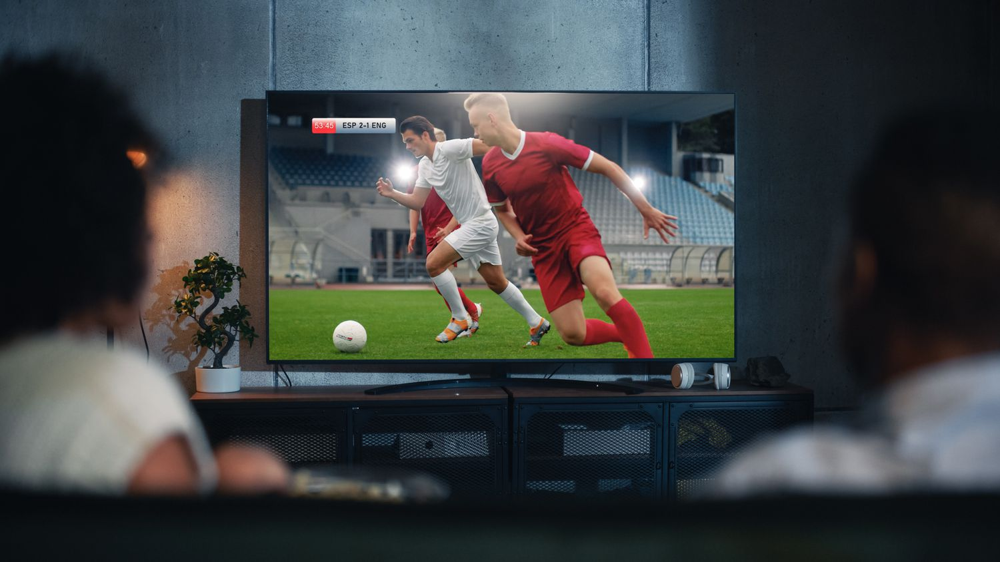

### Games to watch today 
#### 12.15.2025

[Daily Blog](../Soccer-Stuff/daily-blog.md) | [Games to watch](../Soccer-Stuff/games-to-watch.md) | [Who are We](../Soccer-Stuff/who-are-we.md)

Desktop operating systems provide the software environment that allows users to interact with computer hardware. Here are three popular options:

| Games | Time - EST |
| ----- | -----------------|
| 10:30 AM | Chelsea - Real Madrid |
| 12:00 PM | Manchester City - PSV |
| 2:00 PM | Manchester United - Bayern Munchen |
| 4:00 PM | Galatasaray - Borussia Dortmunt |

## 🪟 Windows
- Developed by Microsoft.
- Supports a wide range of hardware and software.
- Common in businesses and gaming.

## 🍎 macOS
- Developed by Apple.
- Exclusive to Mac computers.
- Popular among designers and developers.

## 🐧 Linux
- Open-source and community-driven.
- Many distributions (Ubuntu, Fedora, Arch).
- Favored by developers and power users.

Each OS has strengths and weaknesses depending on user needs.